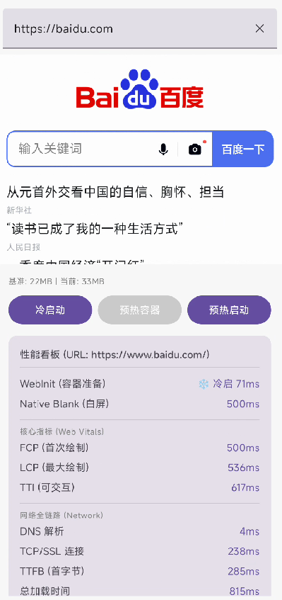

# Android WebView 学习与性能监控记录

本项目是一个关于 Android WebView 优化与监控的学习实践项目。主要包含一个高性能监控 SDK 实现以及一个用于演示性能差异的 Demo App。

## 项目结构



- **`webviewmonitor`**: 核心监控模块（Android Library）。
    - 无侵入式接入，支持自动注入 JS 脚本。
    - 采集 Native + Web 全链路性能指标。
    - 支持 Web Vitals (FP, FCP, LCP, FID, CLS) 指标。
- **`app`**: 演示模块（Android App）。
    - 展示了 WebView 的**冷启动**、**预热加载**性能对比。
    - 提供可视化看板，实时查看各项性能数据。
    - 演示了如何处理自定义 Scheme 以及与监控 SDK 的集成。

## 监控指标说明

### 1. Native 关键路径
- `Native WebView Create`: 统计 WebView 实例化的耗时。
- `Native LoadUrl`: 记录从业务发起加载请求的时刻。
- `Native Blank (白屏时间)`: 衡量从用户点击/导航开始到 `onPageFinished` 的总感受时长。

### 2. Web Vitals (核心网页指标)
通过 `PerformanceObserver` 自动采集：
- **FP / FCP**: 首次绘制与首次内容绘制。
- **LCP**: 最大内容渲染，衡量主要内容出现的速度。
- **TTI**: 可交互时间，衡量页面何时真正可用。
- **CLS**: 累计布局偏移，衡量视觉稳定性。

### 3. 网络与资源耗时 (Navigation Timing)
- **DNS/TCP/SSL**: 底层网络连接耗时。
- **TTFB (首字节)**: 服务器响应速度。
- **Resource Timing**: 支持查看页面前 N 个关键资源的加载详情。

## 快速上手

### 1. SDK 初始化
在 `Application` 或 `MainActivity` 中初始化：
```kotlin
WebViewMonitor.init(application, WebViewMonitorConfig(
    sampleRate = 1.0f, // 学习环境建议 100% 采样
    enableResourceTiming = true
))
```

### 2. 接入监控
```kotlin
val webView = WebView(this)

// 1. 记录创建耗时
WebViewMonitor.recordWebViewCreate(webView)

// 2. 绑定监控
WebViewMonitor.attach(webView, object : WebViewMonitorListener {
    override fun onMetricsCollected(webView: WebView, metrics: WebMetrics) {
        // 在这里获取所有性能数据
        Log.d("Performance", metrics.toReportMap().toString())
    }
    
    override fun onError(webView: WebView, error: String) {
        Log.e("WebViewError", error)
    }
})

// 3. 发起加载
WebViewMonitor.recordUserClick(webView) // 记录用户点击起点
webView.loadUrl("https://github.com")
```

## Demo 演示功能
- **冷启动**: 直接创建新 WebView 并加载，模拟最慢的场景。
- **预热容器**: 点击“预热”后提前在后台创建一个 WebView 实例。
- **预热启动**: 使用已预热的实例加载 URL，可直观看到 `WebInit` 耗时的大幅降低。

## License
[MIT License](LICENSE)
